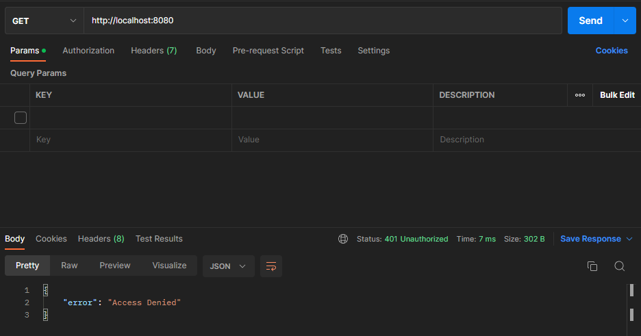
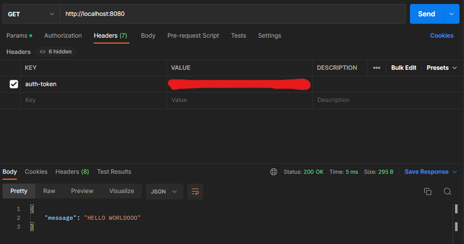
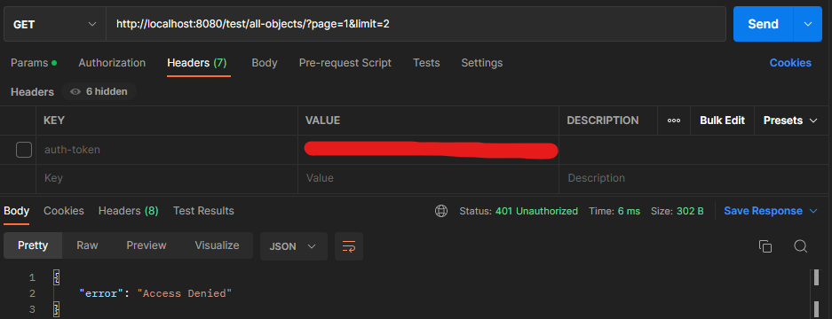
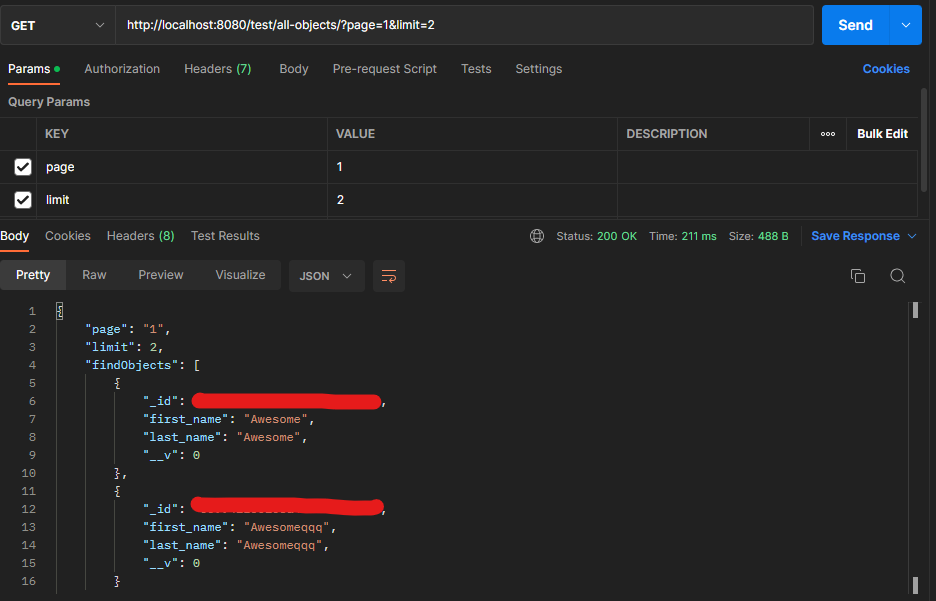
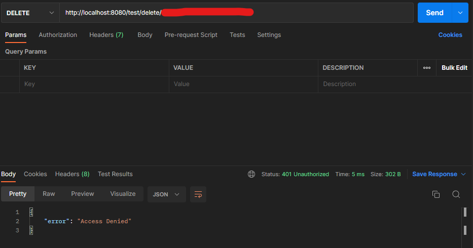
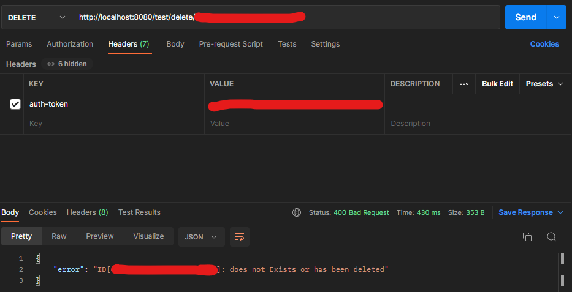

# nodejs-express-mongodb
Node.js Restful CRUD API with Express and MongoDB

Here are the steps to get you started:
1. Clone the repository
````ruby
# Navigate to the directory where you want to clone the repository
cd /path/to/directory
# Clone the repository using the URL
git clone https://github.com/user/repository.git
````
2. Install modules and packages 
````ruby
# Navigate to the directory that contains the git repository
cd /path/to/directory

# Install the dependencies listed in the `package.json` file
npm install
````
3. Setup your .env 
````ruby
# Use the `touch` command to create a new file named ".env"
touch .env

# Use the `code` command to open and edit the ".env" file. 
# This will only work if your text editor is configured properly.
code .env

# If it does not work open it manually on your text editor.

# Replace the `< >` with your own information.
DB_URI=mongodb+srv://<Cluster URL>.mongodb.net/
DB_NAME=<Database name>
DB_USER=<Database Username>
DB_PASSWORD=<Database Password>
PORT=8080
# The "TOKEN_SECRET" is for JSONwebtoken and will be needed if a route requires an authorization token.
TOKEN_SECRET=<Custom Token>
````
3. Start server locally
````ruby
# Start the server on your CLI
npm start

# To verify that the server started successfully the code format will be this

[nodemon] 2.0.20
[nodemon] to restart at any time, enter `rs`
[nodemon] watching path(s): *.*
[nodemon] watching extensions: js,mjs,json
[nodemon] starting `node server.js`

[Port    ] Server is running [ 8080 ]
[Database] Mongoose connected to DB Cluster [ <DB_NAME> ]
[Finished] Connection estabislished with MongoDB Successfully
[Token   ] <TOKEN_SECRET>
# If there is an error connecting to the MongoDB, check your .env values.

````

# Features

| Routes       | Description   | Pagination | Validation | Token    |
|---|---|---|---|---|
| ./  | home route  |  N/A  | N/A  | required |
| ./test/all-objects/  | **Get** all `Object`    | page = N <br> limit = N  | Checks if Database is empty | required |
| ./test/new           | **Create** new `Object` | N/A  | > Checks `first_name` and `last_name` if it exists <br> > Checks if it staisfies Joi Schema  | required |
| ./test/delete/:id    | **Delete** a specific `Object`via `:id`| N/A  | Checks if `:id` exists | required |

# Schema

### JOI

````ruby
    first_name: Joi.string()
        .min(3)
        .required(),
    last_name: Joi.string()
        .min(3)
          .required(),
````
### Mongoose

````ruby
    first_name: {
        type: String,
        required:true,
        min: 3,
        max: 255
    },
    last_name: {
        type: String,
        required:true,
        min: 3,
        max: 255
    }
````
# Postman Example
>### Home
>
> Without `token` in Headers.
>
>
> With `token` in Headers.

>### `Get` all data from the Database.
>
> Without `token` in Headers.
>
>
> With `token` in Headers. Parameters are set as page and limit with corresponding values of choice.

>### `Delete` a specific Data from the Database.
>
> Without `token` in Headers.
>
>
> With `token` in Headers.
